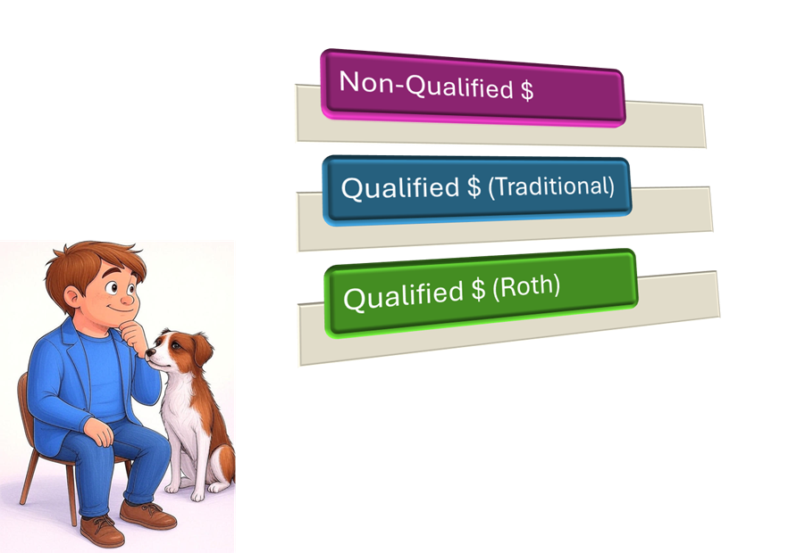

# Introduction to Wealth Classification

For the purposes of financial and retirement planning in the United States, an individual's wealth can often be categorized into three primary types: non-qualified, qualified (traditional), and qualified (Roth) accounts. While this framework effectively captures most financial assets, certain forms of wealth—such as private business equity or non-financial assets like collectibles—may not fit neatly into these categories. This tutorial assumes the majority of an individual’s wealth can be classified into one of these three types, providing a foundation for understanding smart-money strategies. Below, each classification is explained separately:
