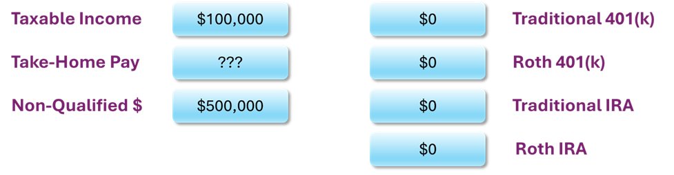
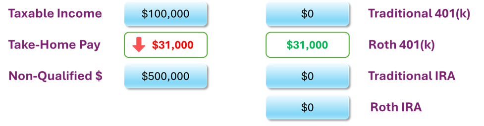
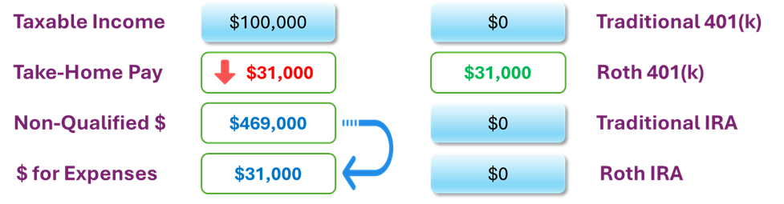

# Max Fund a Roth 401k

Here’s one powerful “depth‑leveraging” play: super‑charge your 401(k) contributions—even past the point that your take‑home pay no longer covers monthly living costs—and backfill the shortfall with your excess savings. Let's take a look:

 

 

In the diagram above, you have $500,000 in taxable savings (non-qualified accounts)—money that may have come from an inheritance or simply years of diligent saving. You also have $100,000 in taxable income and no existing retirement account balances. This combination of high liquidity and low retirement account exposure creates a unique opportunity to implement long-term tax-efficient strategies, such as Roth contributions or conversions.

 

 

Let’s assume you are over age 50, and your maximum 401(k) contribution in 2025 is $31,000. Suppose your employer’s 401(k) plan offers a Roth option, but up to this point, you haven’t been contributing. In the diagram above, you’ve now chosen to max out your Roth 401(k). As a result, your take-home pay decreases by $31,000, since Roth 401(k) contributions are made with after-tax dollars. However, your taxable income remains unchanged—the full $100,000 is still subject to tax because Roth contributions do not reduce your taxable income.

There’s just one issue: your reduced take-home pay may no longer cover your living expenses. This creates a short-term cash flow gap, but thanks to your substantial non-qualified savings, you have a solution.

 

 

The last diagram illustrates how $31,000 from your taxable savings is used to supplement your take-home pay. This ensures your total cash available for living expenses remains unchanged, even though you're now fully funding your Roth 401(k).

# Observations

In effect, all that’s really happened is a shift of $31,000 from non-qualified (taxable) savings into Roth 401(k) savings. You haven’t increased your taxable income, changed your total living expenses, or triggered any tax consequences in the current year. But you have meaningfully improved the long-term tax efficiency of your portfolio. 

In most situations, Roth savings are more advantageous than non-qualified savings: they grow tax-free, are not subject to required minimum distributions, and can be withdrawn tax-free in retirement. By using your excess savings to support your living expenses while you contribute aggressively to your Roth 401(k), you’re simply reallocating funds from a taxable environment to a tax-free one—something most savers would gladly choose if given the opportunity.

# I Don't Have a Roth Option in My 401(k)

If your employer’s 401(k) plan doesn’t offer a Roth option, you’re not out of luck—there are still powerful strategies to consider. While you won’t be able to contribute directly to a Roth 401(k), you can still take advantage of your excess savings and low retirement account balances to move money into Roth territory through a different route. The key is to use a traditional 401(k) in combination with an in-service rollover and a Roth conversion. This approach requires a few extra steps, but the end result can be very similar: tax-free growth and tax-free withdrawals down the road. In the next section, we'll walk through how this works.

