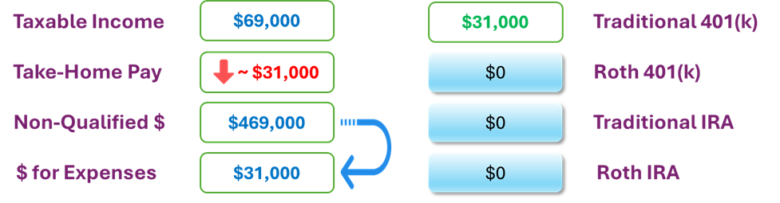
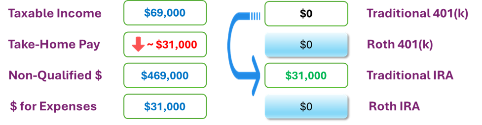
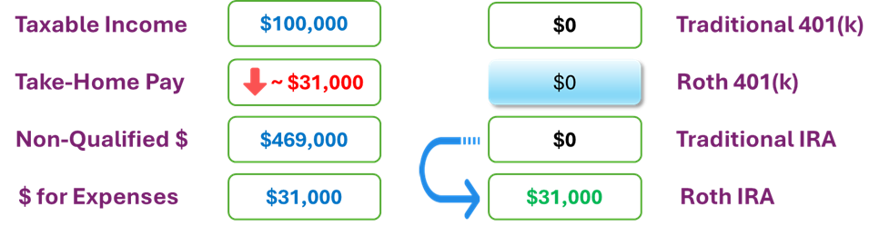

# Max Fund Your Traditional 401(k) and Possibly Convert to Roth

If your 401(k) plan doesn’t offer a Roth option, you can still pursue a powerful strategy to shift money from taxable savings into a tax-free Roth environment. Using the same assumptions as before—$500,000 in non-qualified (taxable) savings, $100,000 of taxable income, and no retirement account balances—you begin by maxing out your traditional 401(k) contributions. 

 

 

For someone age 50 or older, that means contributing $31,000 in 2025. This reduces your take-home pay by $31,000 but also lowers your taxable income from $100,000 to $69,000. To maintain your lifestyle, you use $31,000 from your savings to supplement your reduced take-home pay, keeping your total spending power exactly where it was before. You've essentially moved $31,000 from a taxable environment into a tax-deferred one—without sacrificing anything in the short term.

Once you're eligible—typically after age 59½, or sooner if you're planning to change jobs—you take the next step: an in-service rollover of your 401(k) funds into a traditional IRA. Many 401(k) plans allow this after 59½, though some may not, in which case a future job change or retirement would unlock the opportunity. 

 

 

Once the funds land in the IRA, you can then convert them to a Roth IRA. The amount you convert will be added to your taxable income for the year, but if you convert the same $31,000 you initially contributed, the tax deduction you received when you made the 401(k) contribution effectively offsets the tax on the conversion. You’ve returned your taxable income to the original $100,000 level, while quietly relocating $31,000 from taxable savings to a Roth IRA—where it can now grow tax-free for life.

 

 

This strategy gives you the same long-term outcome as if your 401(k) had included a Roth option: tax-free growth and tax-free withdrawals in retirement. Even better, by controlling the timing and size of your Roth conversions, you can fine-tune the tax impact based on your income, deductions, and other financial goals in any given year. And if you're between the ages of 60 and 63, the higher “super catch-up” limit of $34,750 gives you even more room to shift money efficiently. So even without direct access to a Roth 401(k), your deep savings and thoughtful planning give you access to the same powerful strategy—just through a slightly different route.
